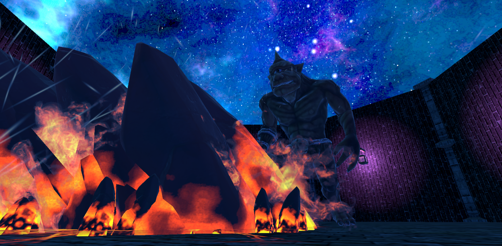

# VRShooting

Meta Questで動作するVRダンジョンシューティングゲームです。
敵を撃ち倒しながらダンジョンを探索します。

## 概要

| 項目 | 内容 |
|------|------|
| プラットフォーム | Meta Quest |
| SDK | Meta XR SDK |
| エンジン | Unity |
| 開発人数 | 1人 |
| 展示実績 | KOSEN FES 2025にて展示 |

## 技術的なポイント

- **ボスの攻撃モーション実装**
  エフェクトへの当たり判定付与、アセットのモーションをゲーム仕様に合わせて改造

- **Meta XR SDK を用いたVRインタラクション**
  コントローラー操作・照準・射撃の実装

## 使用技術

- Unity
- C#
- Meta XR SDK

## 実行環境

- Meta Quest（実機）

## 開発者

[river0525](https://github.com/river0525) 
- X: [@river0525165521](https://x.com/river0525165521)
- Qiita: [river0525](https://qiita.com/river0525)
